# ビルドガイド

## 0.組み立て順序
**組み立て順序**は右の `ON THIS PAGE` をご参照ください。
**順序を間違えると復旧が難しい場合があります**ので、組み立て前に一通り手順をご確認ください。

使用するパーツの名称は以下の通りです。
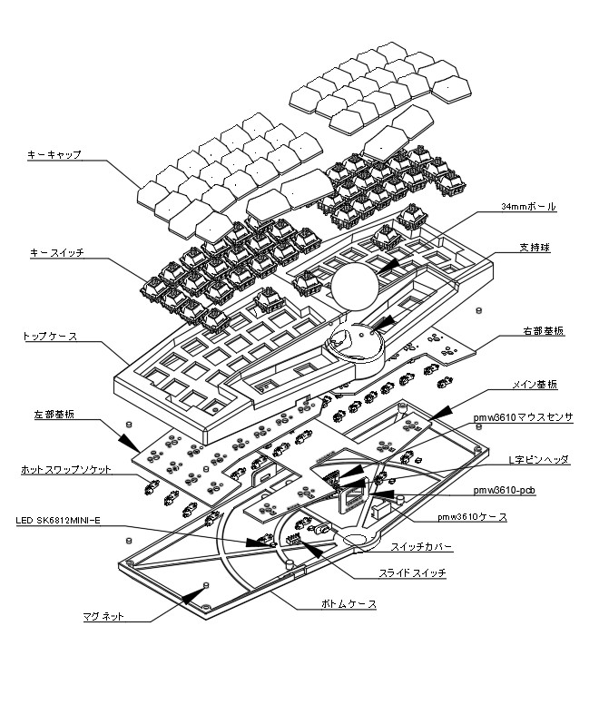

なお、以下の部品は予めPCBAにより基板へ取り付け済みです。
- `ダイオード`
- `ホットスワップソケット`
- `FFCコネクタ`
- `PHコネクタ`
- `LED`

また溶接・溶着を円滑にしてくれる`プリント基板用フラックス`を使用すると`はんだ`が乗りやすいため、使用することを強く推奨します。

## 1.ファームウェアの書き込み
**1-1.ファームウェアのダウンロード**
以下のリンクをクリック。
- [Tentalice firwmware](https://github.com/Cerbekos/Tentalice/tree/main/firmware)
ファームウェアの名前をクリック。
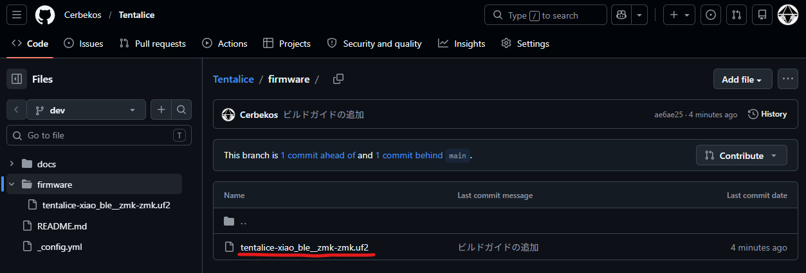
ダウンロードをクリックして`uf2ファイル`を保存。
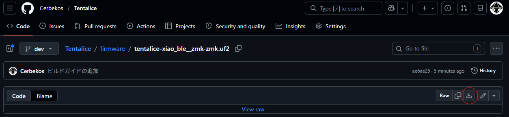

**1-2.ファームウェアの書き込み**
`XIAO BLE`を`USB`で`PC`に接続し、表面の`リセットボタン`を素早く2回押下します。
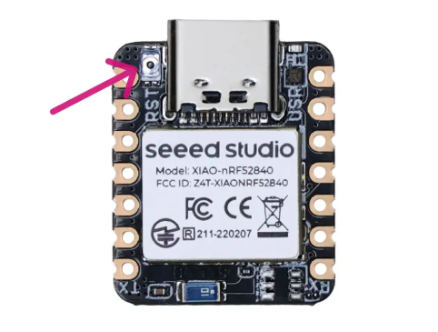

成功するとブートモードとなり、`XIAO BLE`のドライブが表示されますので、ここへダウンロードした`uf2ファイル`をコピーします。自動的にリブートされ、ファームウェアが書き込まれます。

## 2.XIAO BLEの取り付け
本工程では、`XIAO BLE`をメイン基板にはんだ付け（表面実装）します。

**2-1.予備はんだの実施**
`XIAO BLE`背面の以下の画像の箇所（BAT＋－）へ少量の予備はんだを行います。

~ |             |             |
~ | :---:       | :---:       |
~ | [~xiao1]       | [~xiao2]       |
:::warp xiao1
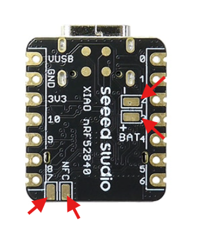
BAT＋－の位置
:::
:::warp xiao2
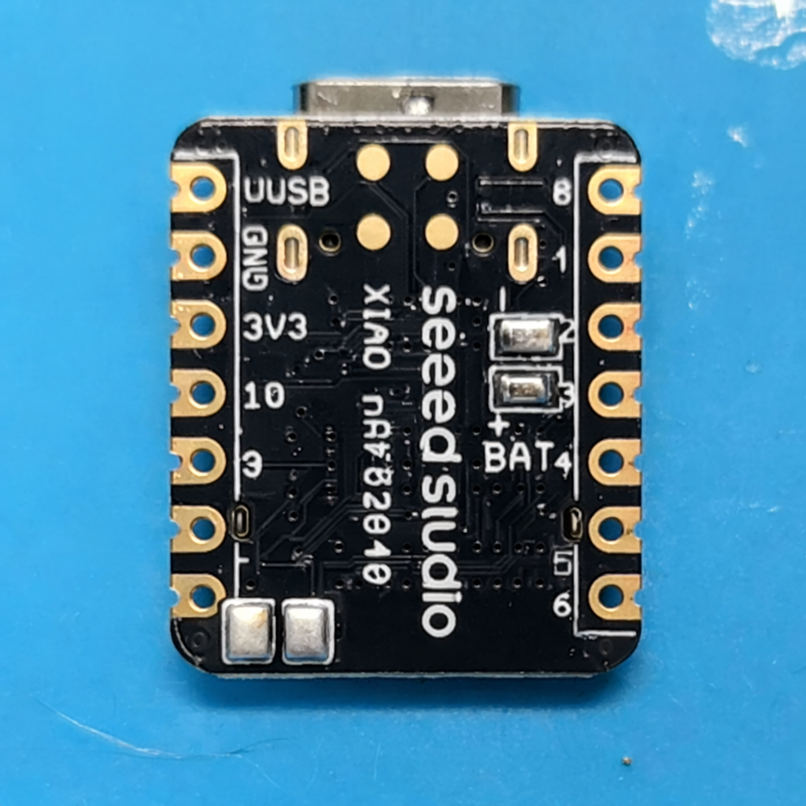
少量のはんだ付け後
:::

**2-2.位置合わせ**
メイン基板へ`XIAO BLE`を乗せ、正確に位置を合わせます。マスキングテープで固定します。
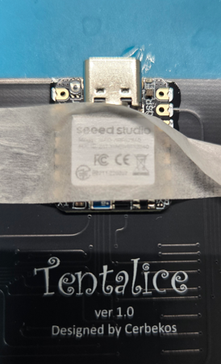

**2-3.はんだ付け**
側面からはんだ付けを行います。
~ |             |             |
~ | :---:       | :---:       |
~ | [~xiao3]       | [~xiao4]       |
:::warp xiao3
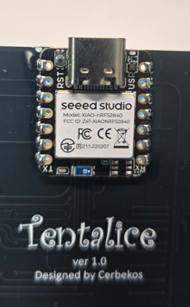
両側をはんだ付け後
:::
:::warp xiao4
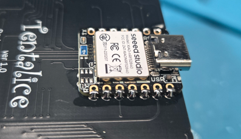
横から見たところ
:::

背面へはんだを流し入れます。隣と短絡しないように注意してください。
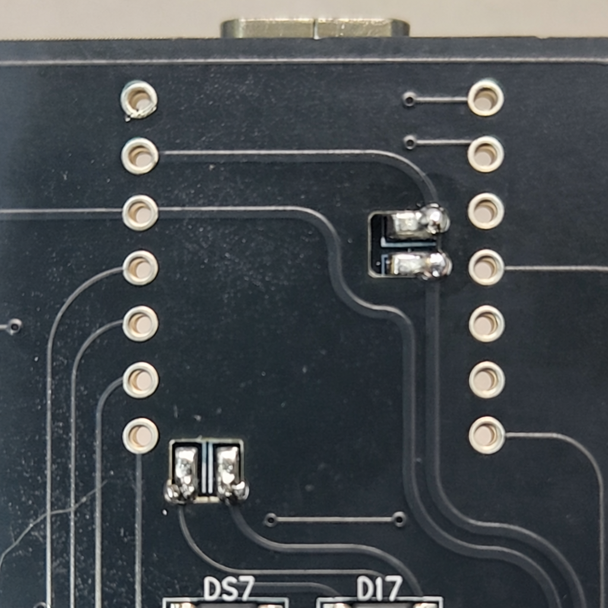

## 3.LEDの取り付け
PCBA実装済みです。次の手順へ進んでください。
:::details 初期頒布品の場合はこちらを開いて手順を確認してください
本工程はオプションです。`LED`を取り付けなくても動作には支障ありません。

**3-1.位置合わせ**
`LED`には向きがあり、`GND`にある斜めの切り込みが目印です。
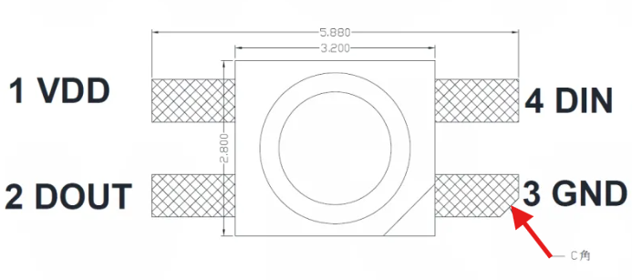

メイン基板の背面へ`LED`を画像の向きで乗せ、位置を合わせます。
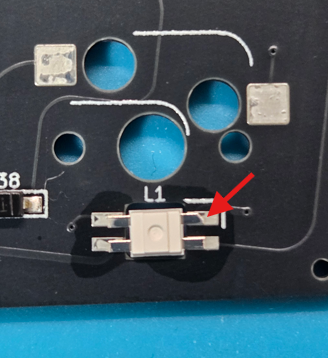

**3-2.はんだ付け**
端子をはんだ付けします。**`LED`は高温に弱いため、260度程度**に温度を設定してください。
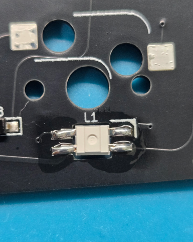

`LED`はメイン基板に4か所取り付けできますので、すべてはんだ付けします。
一度`XIAO BLE`に`USB`を接続して`LED`が点灯するかを確認します。なお、一定時間経過すると自動で`LED`をオフにする制御を入れていますのでご留意ください。
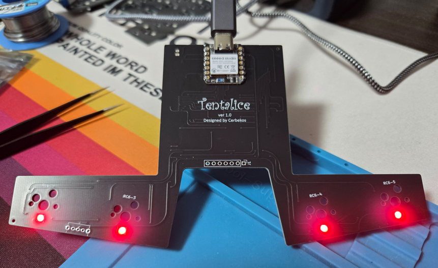
:::

:::details もしLEDが点灯しない場合は
| 原因例 | 対策例 |
| :---- | :---- |
| `LED`のはんだの量が足りていない、または多すぎて隣と接合している | はんだごてやはんだ吸い取り線を使いはんだの量を調整してください |
| `LED`の取り付け向きが誤っている | はんだ吸い取り線を使い、慎重にはんだを除去してから向きを正しくし、はんだ付けしてください |
| `XIAO BLE`のはんだの量が足りていない、または多すぎて隣と接合している | はんだ付けし直したり、多い場合ははんだ吸い取り線などを使い、はんだの量を調整してください |
:::

## 4.ホットスワップソケットの取り付け
PCBA実装済みです。次の手順へ進んでください。
:::details 初期頒布品の場合はこちらを開いて手順を確認してください
本工程では、`ホットスワップソケット（以下、単にソケット）`をメインと左右の基板にはんだ付けします。

**4-1.位置合わせ**
`ソケット`の正しい向きは、白い線が隠れるような向きとなります。

**4-2.はんだ付け**
`ソケット`が浮いていないことを確認し、はんだ付けします。
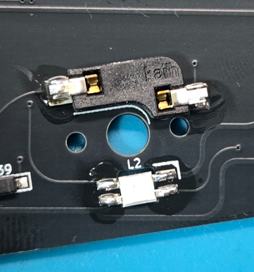

`ソケット`は全42か所あります。はんだの付け忘れが頻発するので注意しましょう。
:::

## 5.スライドスイッチの取り付け
本工程では、`スライドスイッチ`をメイン基板にはんだ付けします。

**5-1.位置合わせ**
`スライドスイッチ`の正しい向きは、メイン基板の背面からスライド部品が手前に来る向きとなります。
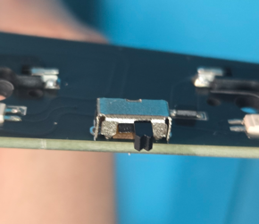

**5-2.はんだ付け**
`スライドスイッチ`が浮いていないことを確認のうえマスキングテープで固定し、表面からはんだ付けします。
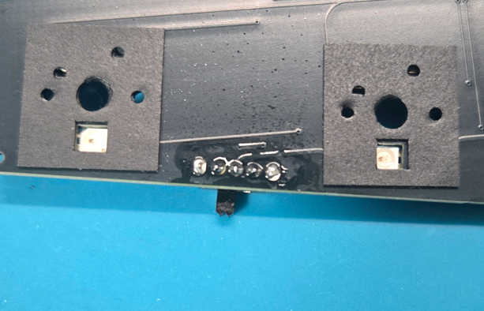

## 6.PHコネクタの取り付け
PCBA実装済みです。次の手順へ進んでください。
:::details 初期頒布品の場合はこちらを開いて手順を確認してください

本工程では、`PHコネクタ`をメイン基板にはんだ付けします。

**6-1.位置合わせ**
`PHコネクタ`の正しい向きは、メイン基板の背面から右向きとなります。
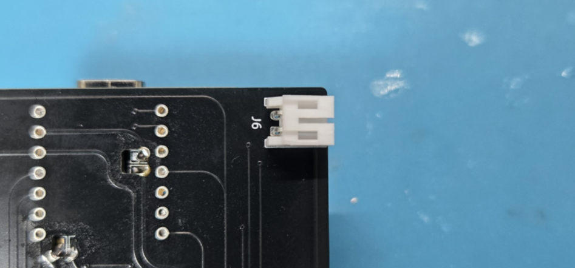

**6-2.はんだ付け**
`PHコネクタ`が浮いていないことを確認のうえマスキングテープで固定し、表面からはんだ付けします。
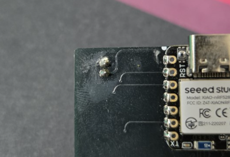
:::

## 7.マウスセンサー基板の取り付け
```
ℹ️マウスセンサー基板はばりが残っていると組み立てにくいため、やすりでばりをきれいにしてから
   取り付けてください。
```
本工程では、`PMW3610 マウスセンサー`を`ブレークアウトボード`へ取り付けてから、`L字ピンヘッダ`を使ってメイン基板へ取り付けします。

**7-1.電圧レベルの設定**
`ブレークアウトボード`で3.3Vの電圧に設定するため、**1と2がショート([1-2 3])**するようにジャンパします。
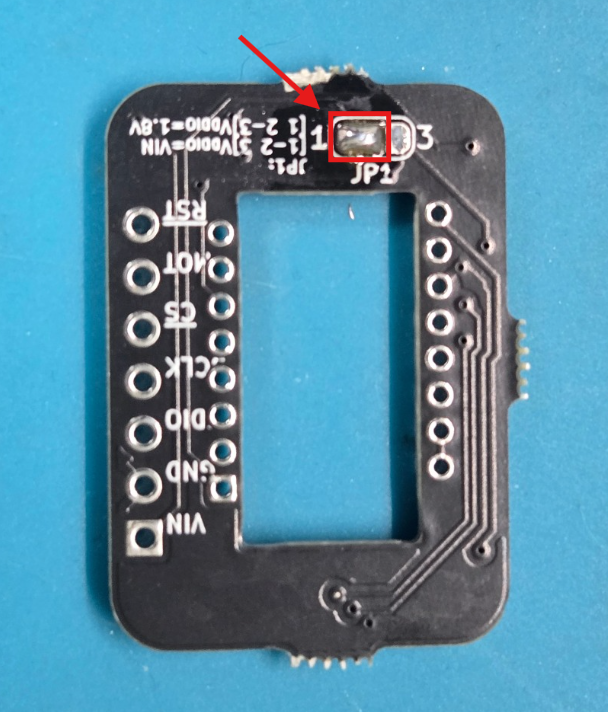

**7-2.PMW3610 マウスセンサーの位置合わせ**
`PMW3610 マウスセンサー`の位置を合わせます。ここで位置を反対に取り付けるとリカバリできないため注意してください。以下の画像のように、**ジャンパに対して反対側に球体がある**向きにします。
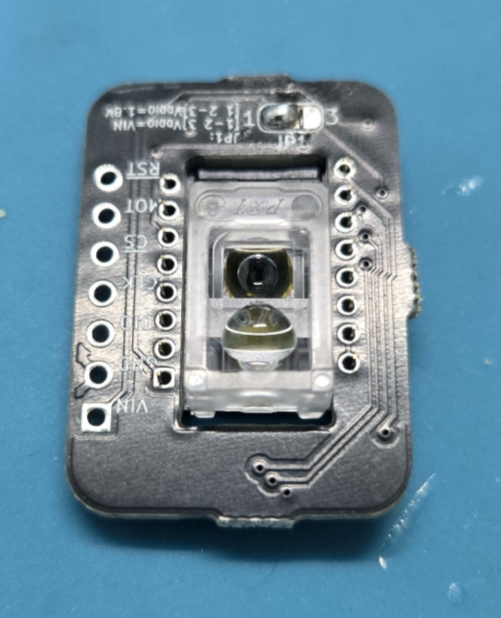

位置合わせ後、**マスキングテープで固定してから**、透明のレンズ部品を取り外します。
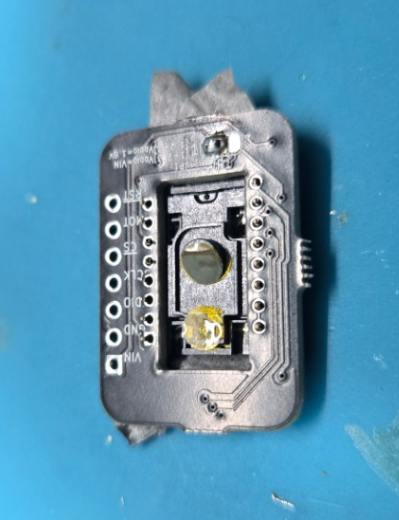

**7-3.PMW3610 マウスセンサーのはんだ付け**
慎重にすべてのピンをはんだ付けします。
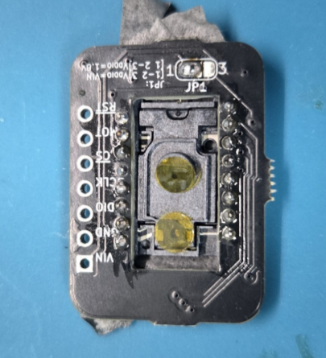

**7-4.L字ピンヘッダの位置合わせ**
`L字ピンヘッダ`は、レンズ部品とは反対面に、ピンが内側に来る向きに位置合わせします。
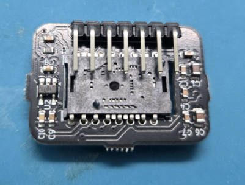

位置合わせ後、**ピンが正確に90度となっているかを確認し、マスキングテープで固定**します。
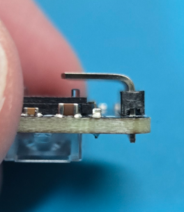

**7-5.L字ピンヘッダのはんだ付け**
上手く部品を固定し、ピンをはんだ付けします。
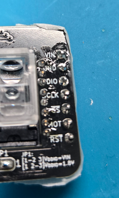

**7-6.メイン基板への取り付け**
メイン基板の背面から`L字ピンヘッダ`を差し込み、マスキングテープで固定します。
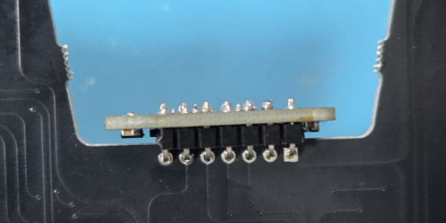

角度が90度であることを確認し、表面からピンをはんだ付けします。
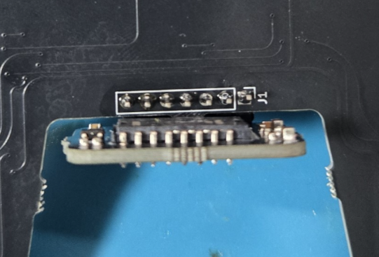

はんだ付けの後、黄色の保護シールを剥離し、レンズ部品を取り付けます。

## 8.基板の動作確認
以上ではんだ付けの工程は完了ですので、ここまでの作業で不具合がないかを確認します。

**8-1.キーやセンサーの入力確認**
`XIAO BLE`に`USB`を接続し、テキストエディタを開いて、`各キー`が反応するかを確認します。ただし、現状は**キースイッチ**を取り付けていないため、ピンセットで**各ソケット**の両端を導通させて文字が表示されるかを確認します。また、トラックボールセンサーのレンズに指などを近接させ、マウスカーソルが反応するかを確認します。

:::details もし反応しない場合は
| 原因例 | 対策例 |
| :---- | :---- |
| うまく導通できていない | ピンセットで反応がない場合でもキースイッチを差し込むと上手くいくときがたまにありますので、ピンセットがだめならスイッチをつけて動作確認してみてください |
| `キースイッチ`のはんだ付けの付け忘れ | キーが反応しないとき一番多い原因です。はんだ付けをし直してしてください |
| `XIAO BLE`のはんだの量が足りていない、または多すぎて隣と接合している | はんだ付けし直したり、多い場合ははんだ吸い取り線などを使い、はんだの量を調整してください |
| `マウスセンサー基板やL字ピンヘッダ`のはんだの量が足りていない、または多すぎて隣と接合している | はんだ付けし直したり、多い場合ははんだ吸い取り線などを使い、はんだの量を調整してください |
:::

**8-2.外部電源での動作確認**
外部電源から電力を得た状態で、Bluetooth接続によるキーの入力確認を行います。
向きに注意しながら`LiPoバッテリー`のコネクタ接続します。
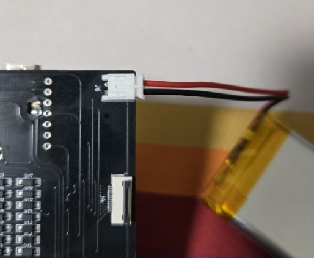

起動すると、LEDが点灯したり、Bluetoothがペアリング状態になります。
PCまたはスマートフォンでBluetoothの接続を行います。Bluetooth接続は、初期状態であれば、電源が供給されると自動的にプロファイル０でペアリング開始モードになります。

:::details Bluetooth接続のプロファイルの変更やクリア
初期キーマップではLayer5に配備しています。Layer5は、赤もしくは青のキーを二つ同時押しして入るように設定しています。
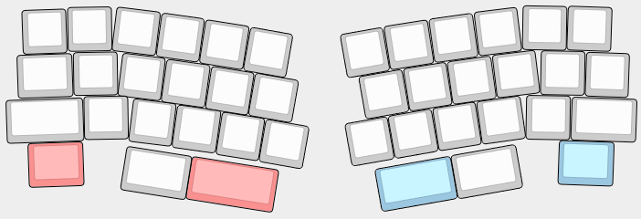
:::
:::details もしキーボードが起動しない場合は
| 原因例 | 対策例 |
| :---- | :---- |
| `XIAO BLE`の背面のパッド（BAT＋－）のはんだの量が足りていない、または多すぎて隣と接合している | はんだ付けし直したり、多い場合ははんだ吸い取り線などを使い、はんだの量を調整してください |
| `PHコネクタ`のはんだ付けの付け忘れ | はんだ付けをし直してしてください |
:::

## 9.スライドスイッチカバーの取り付け
`スライドスイッチ`に3Dプリントした`スライドスイッチカバー`を取り付けます。
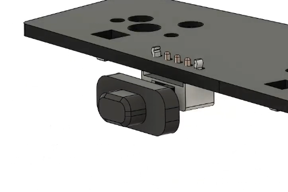

## 10.支持球の接着
`支持球`を`トップケース`に接着します。

**10-1.支持球受けの位置**
以下の3か所に支持球受けがあります。
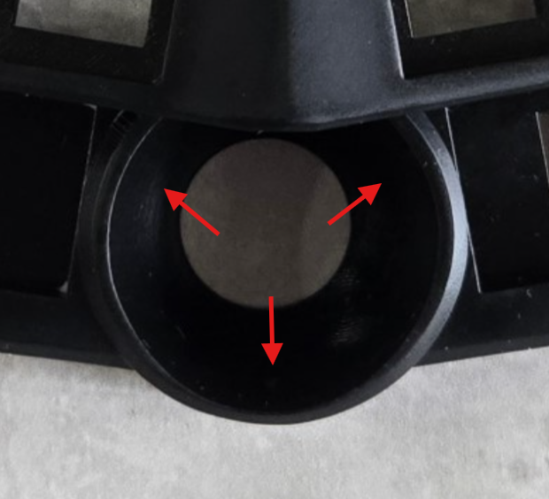

**10-2.支持球の接着**
支持球受けに、爪楊枝などで接着剤を慎重に垂らし、`支持球`を埋め込みます。

## 11.ケース用マグネットの取り付け
ケース用のマグネットを接着剤で固定します。**マグネットの向きにご注意ください。**

**11-1.ボトムケースへのマグネット接着**
`ボトムケース`の四隅に、爪楊枝などで接着剤を1滴垂らし、マグネットを接着します。接着するまでしばらく待ちます。
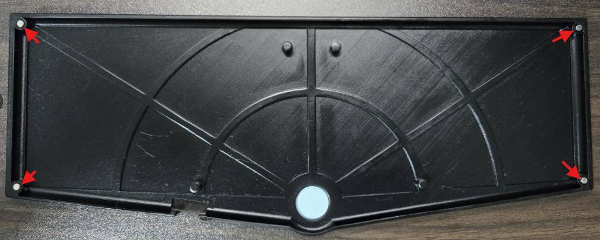

**11-2.マグネットを重ねる**
次に、`ボトムケース`の四隅のマグネットに、`トップケース`用のマグネットをくっつけます。これにより向きを間違えて取り付けることを防止します。
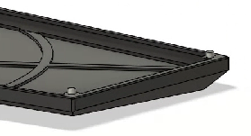

**11-3.トップケースを重ねる**
四隅のマグネット上に、爪楊枝などで接着剤を慎重に垂らし、`トップケース`を載せます。マグネット同士が接着剤で接着しないよう量に注意してください。

## 12.キースイッチと左右基板の取り付け
`トップケース`にキースイッチを取り付け、左右基板をキースイッチで固定します。端の方から数個ずつキースイッチと基板を取り付けるように進めてください。

## 13.FFCケーブルの接続
メイン基板と左右基板を繋ぐ`FFCケーブル`を`FFCコネクタ`へ接続します。

**13-1.FFCコネクタとFFCケーブルの接続方法**
`FFCコネクタ`のパネルを上げ、`FFCケーブル`を青色が上面になるようにし、斜めにならないように差し込みます。
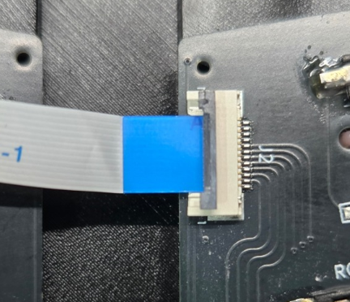

その後、パネルを下げて固定します。

**13-2.左右基板の接続**
左右の基板の`FFCコネクタ`と`FFCケーブル`を接続します。
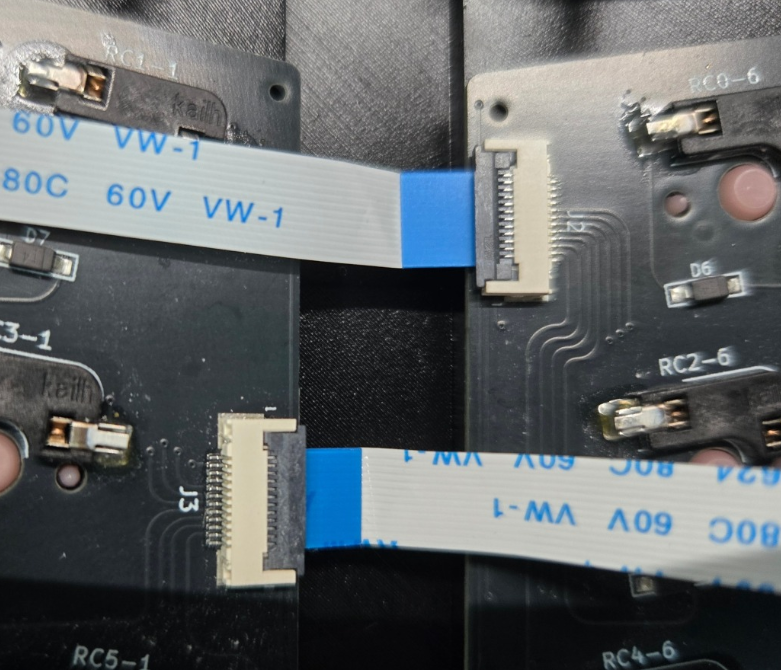

**13-3.メイン基板の接続**
左右いずれかの基板の`FFCケーブル`とメイン基板の`FFCコネクタ`を接続します。
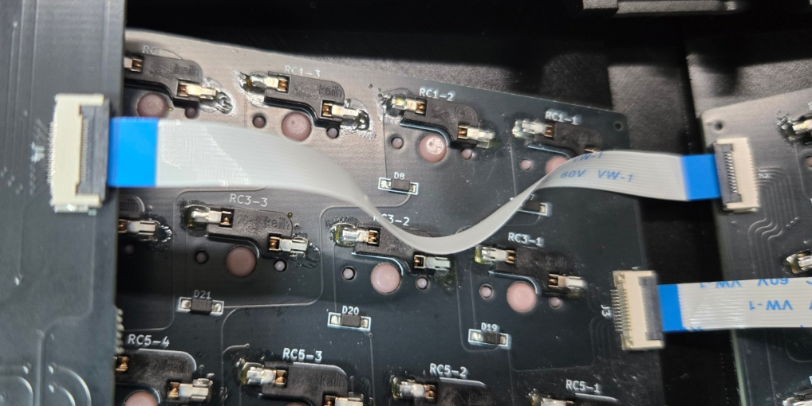

残りの`FFCケーブル`とメイン基板の`FFCコネクタ`を接続します。
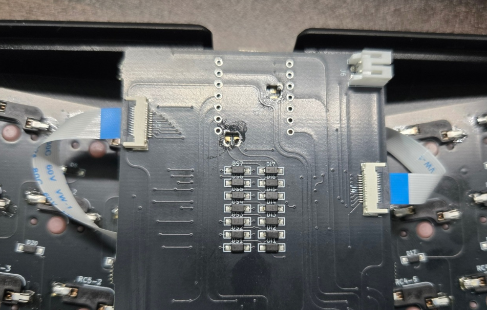

## 14.キーキャップの取り付け
`キーキャップ`を`キースイッチ`に嵌め込みます。

## 15.34mmボールの取り付け
最後にトラックボールマウス用の`34mmボール`をボール受けに嵌め込んで動作を確認します。

:::details もしボールが反応しない場合は
| 原因例 | 対策例 |
| :---- | :---- |
| `センサーレンズ`が浮いている | `センサーレンズ`がずれていると反応がしなかったり、弱くなります。ボールを一度取り出して指で`センサーレンズ`を押し込んでください |
:::

以上で、ビルドガイドは終了です。

~ |             |             |
~ | :---:       | :---:       |
~ | [パーツリスト](?page=parts) 　←　前へ       | 次へ　→　[使用方法](?page=manual1)       |