# Tentalice

**Tentalice**はAlice配列とトラックボールが特徴のキーボードです。

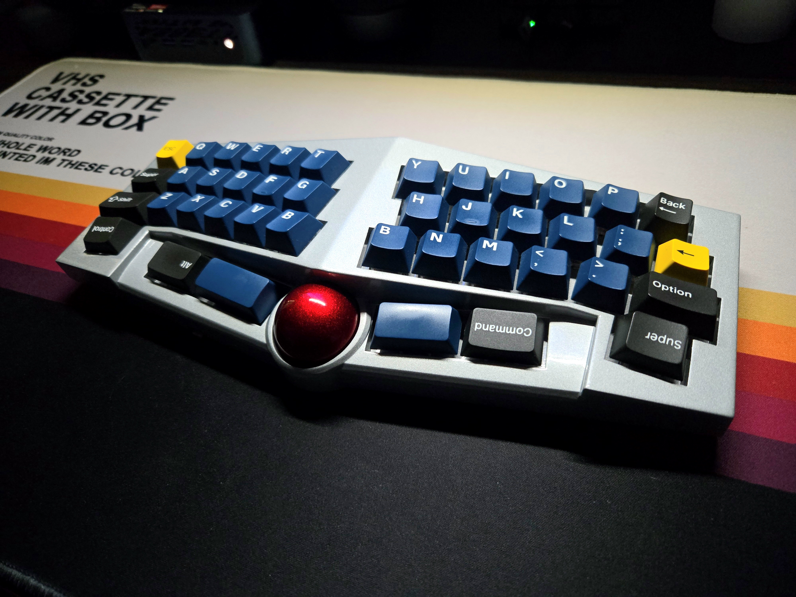

## 1. 特徴
- Alice配列[^1]
- 約8度のテンティング
- 34mmトラックボール
- オートマウスレイヤー対応
- LEDレイヤーインジケータ
- ZMK firmware[^2]による無線接続
- ZMK Studio[^3]対応
- ZMK Keymap Editor[^4]対応
- ZMK Scroll Snap[^5]対応
- ZMK Mouse Gesture[^6]対応
- ZMK Feature Sensor Rotation[^7]対応
- ZMK Pointing Acceleration[^8]対応
- 日本語配列に対応したキーマップ変更が可能

[^1]:**Alice配列**は、中央が逆ハの字（左右にわずかに傾いた）になったコンパクトなキーボードレイアウトで、分割スペースバーを持つ点が特徴です。エルゴノミクス寄りの設計で、標準的なフルサイズ配列からの移行が比較的容易です。
[^2]:**ZMK firmware**はZephyrベースのモダンなオープンソースキーボードファームウェアで、ワイヤレス優先設計・幅広いアーキテクチャ対応・MITライセンスが特徴です。 
[^3]:**ZMK Studio**は、実行中のキーボードに対してUSB/BLE経由でキー配列やレイヤーを動的に変更できるネイティブ／Web対応のアプリケーションです。 
[^4]:**ZMK Keymap Editor**は、nickcoutsos氏が作成された ZMKのキーマップを視覚的に編集・管理できるWebベースのアプリケーションで、GitHub連携やローカルファイル/クリップボードから読み込み・保存が可能です。 
[^5]:**zmk-scroll-snap**は、kot149氏が作成された ZMK の360°スクロール入力を、最も近い X/Y 軸方向に自動でスナップ（補正）する拡張モジュールです。
[^6]:**zmk-mouse-gesture**は、kot149氏が作成された 4方向のマウスストロークの組み合わせをキー入力など任意の ZMK ビヘイビアに変換できる拡張モジュールです。 
[^7]:**zmk-feature-sensor_rotation**は、hsgw氏が作成された ZMKのポインティングデバイス入力を 90°/180°/270° など任意角度で回転補正できる機能を追加する拡張モジュールです。
[^8]:**zmk-pointing-acceleration**は、oleksandrmaslov氏が作成された ZMK のポインティングデバイスに可変加速度（マウス加速）を導入し、速度に応じてカーソル移動量を調整できるようにする拡張モジュールです。

## 2. デザイン
### 2-1. コンセプト
分割キーボードの形状と中央のトラックボールを一つに融合させた入力デバイスです。
左右に広がるキー列が肩を自然に開き、指の可動域に沿って緩やかにカーブを描くことで、無理なく疲れにくい入力体験となるように設計されています。

中央に配置されたトラックボールは指が行き交う動線の中心点。従来必要だったマウスへの移動を省略し、文字入力とポインタ操作がひとつの連続した動作としてつながります。

打鍵とカーソル移動の境界をなくし、思考の流れを止めないことを目的とした構造です。

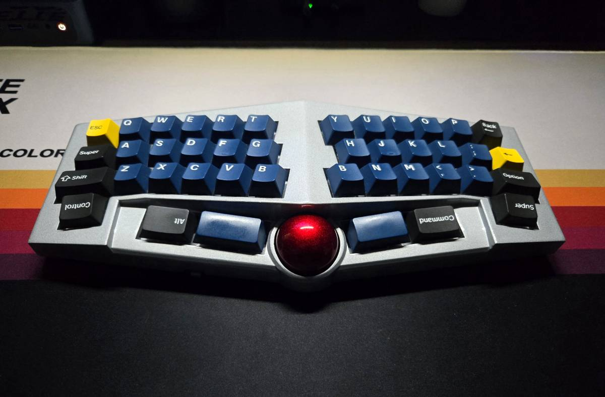

### 2-2. キーレイアウト
Alice配列をベースに放射状に傾斜をつけた独自レイアウトで、わずかに外側のキーにアクセスしやすくなっています。中央の手前にはトラックボール用のスペースがあります。
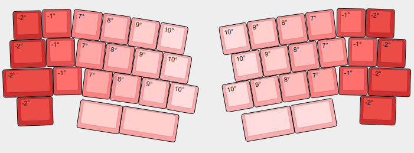

### 2-3. PCB
左右とメイン基板、マウスセンサのブレイクアウトボードの4つで構成しています。
左右とメイン基板は小型のフレキシブルケーブル（FFC）で接続し、マウスセンサは90度傾けて取り付けるためL字ピンヘッダを採用しました。

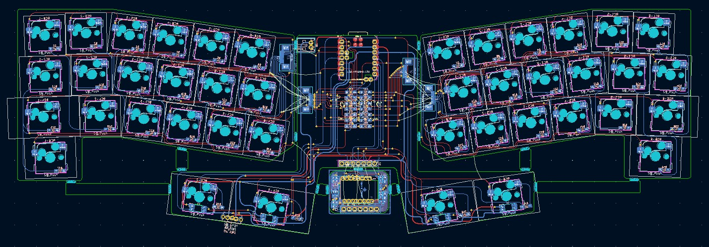

マウスセンサーのブレイクアウトボードは[siderakb氏のpmw3610-pcb](https://github.com/siderakb/pmw3610-pcb)をベースにしつつ、テンティングしたケースに収まるよう小型化しました。

~ |             |             |
~ | :---:       | :---:       |
~ | [~g1]       | [~g2]       |
:::warp g1

siderakb氏 pmw3610-pcb
:::

:::warp g2

小型化したpmw3610-pcb
:::

メイン基板、左右基板、pmw3610-pcbを合体させてPCBA。

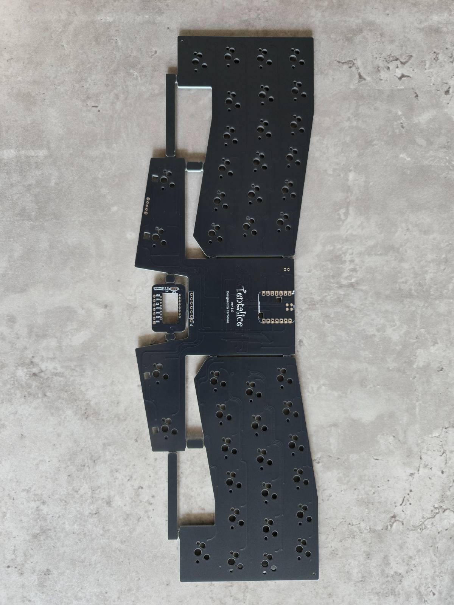
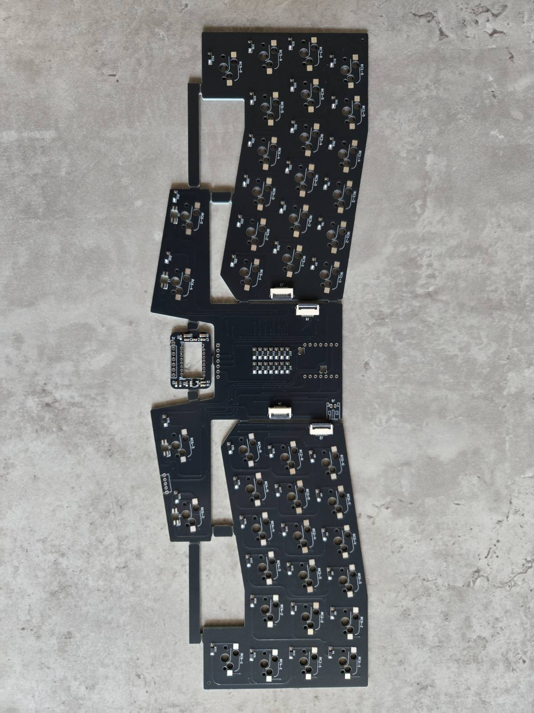

:::details 心の声
> もし何かの間違いでv2を制作するかもしれない未来の私に向けて。
> フレキシブルケーブルの端子のNetの並びは逆の方が良い。
> そしてコネクタの位置は左右の基板の逆側にすることで無理のない取り付けになる。
:::

### 2-4. ケース
Alice配列とトラックボールが美しく調和するよう中央に向けてテンティングした立体的なフォルムにしました。
トラックボールの曲線に合わせたフィレット中心の試作もしましたが、メカニカルなイメージが個人的には好みだったので面取り加工で仕立てました。


3Dプリントによる実物。
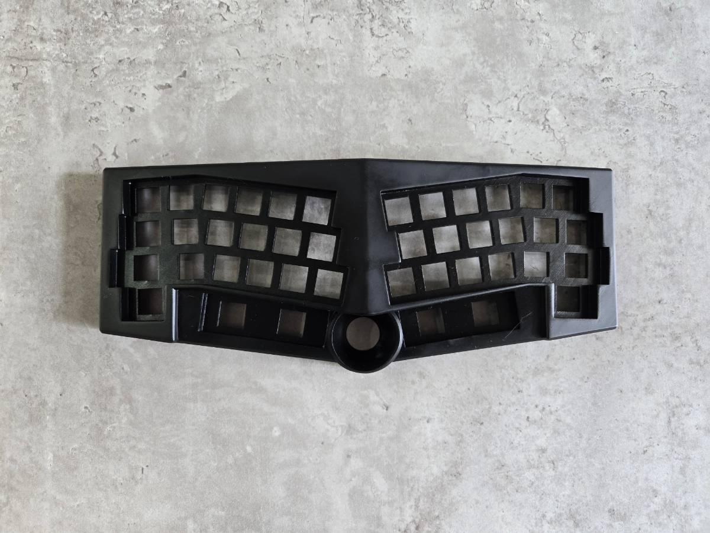
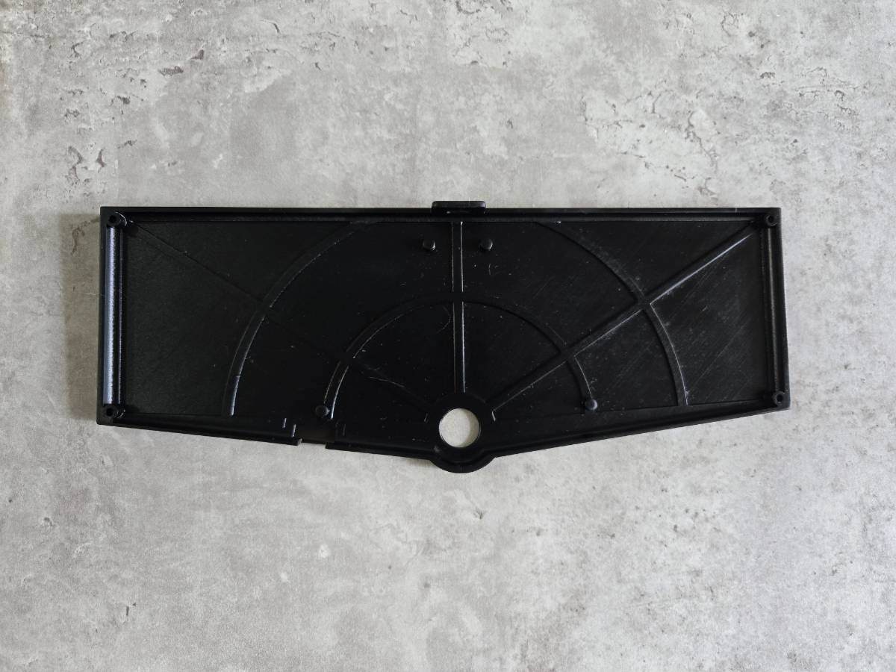

背面には**Tentalice**のロゴがあります。
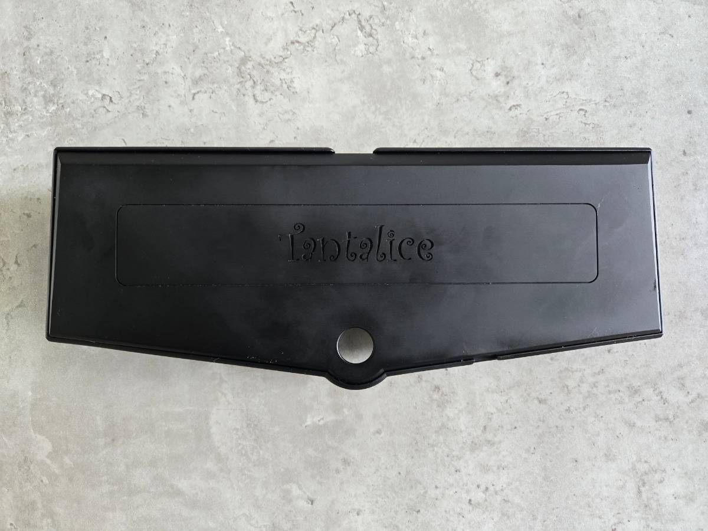

## 3. 機能
### 3-1. キーマッピング
少ないキー数でも”レイヤー”を駆使することにより、ホームポジションを維持しながら快適に素早くタイピングが可能です。

~ |                     |                         |
~ | :---:               | :---                    |
~ | [~img-col1]         | [~text-col1]            |
~ | [~img-col2]         | [~text-col2]            |
~ | [~img-col3]         | [~text-col3]            |
~ | [~img-col4]         | [~text-col4]            |
~ | [~img-col5]         | [~text-col5]            |
~ | [~img-col6]         | [~text-col6]            |

:::warp text-col1
**layer 0**
- 英字と使用頻度のベーシックな記号のレイヤー
- タップダンスを活用してよく使う記号キーを入力可能
:::
:::warp img-col1
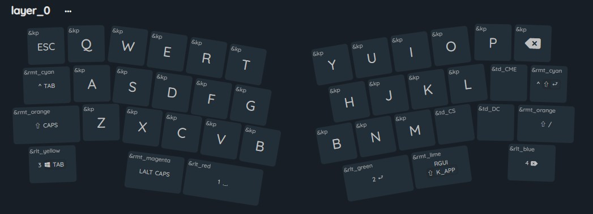
layer 0
:::

:::warp text-col2
**layer 1**
- 数字とファンクションキーのレイヤー
- 数字に関連する記号（+-*/_=@\:など）も配置
:::
:::warp img-col2
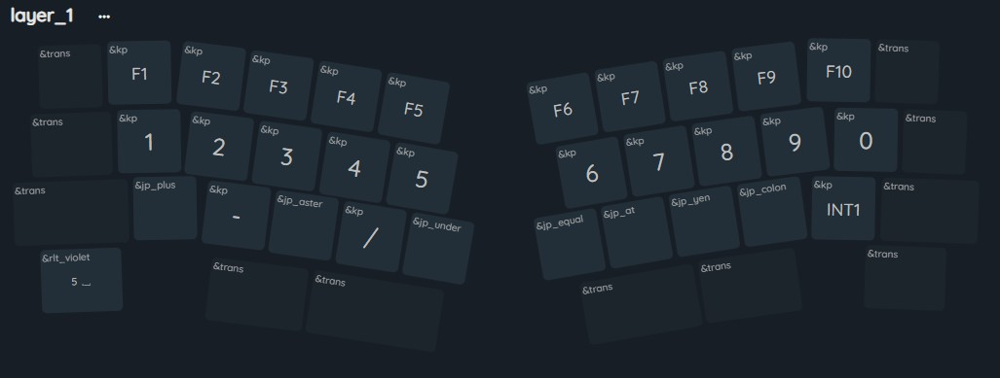
layer 1
:::

:::warp text-col3
**layer 2**
- 記号とカーソル移動のレイヤー
- 左は記号。()[]{}などを上下に配置して入力しやすく
- 右はカーソル移動。Alt＋Up（1階層上へ）も配置
:::
:::warp img-col3
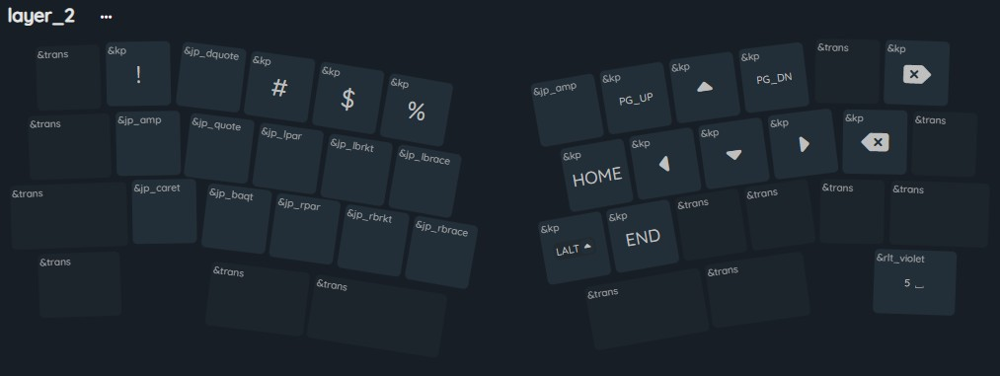
layer 2
:::

:::warp text-col4
**layer 3**
- 左手小指で押すコントロールキーのレイヤー
- 基本はコントロールする場合Tab兼Ctrlのキーを使うがときどき押しちゃうので
:::
:::warp img-col4
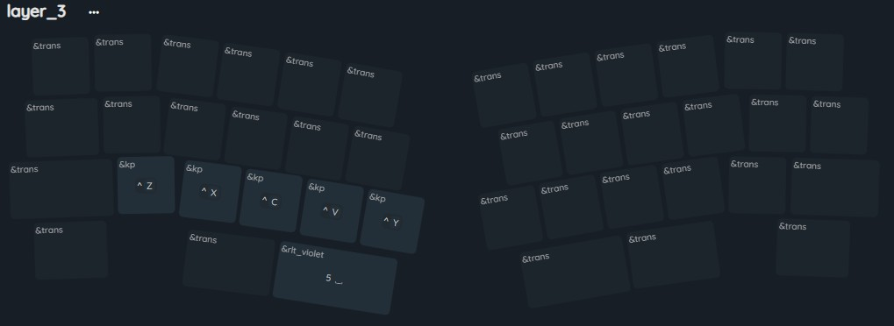
layer 3
:::

:::warp img-col5
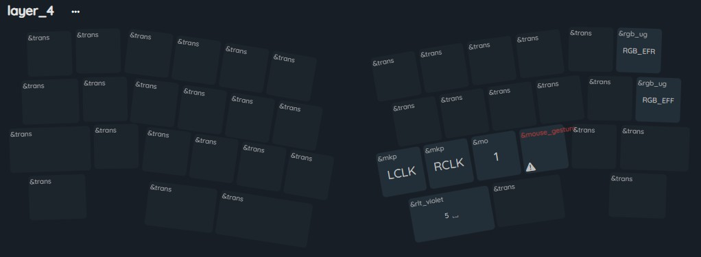
layer 4
:::
:::warp text-col5
**layer 4**
- トラックボール操作キーのレイヤー
- オートマウスレイヤーで自動的にこのレイヤーに入出
- 右の隅にLEDのエフェクト変更
:::

:::warp text-col6
**layer 5**
- Bluetooth操作キーのレイヤー
- むやみにこのレイヤーに立ち入らないよう複数キー押しで入るようにしている
:::
:::warp img-col6
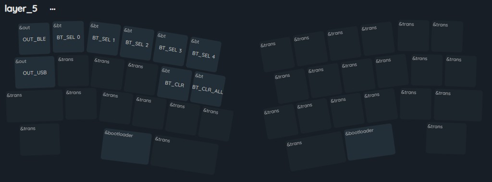
layer 5
:::

### 3-2. キーマップのカスタマイズ
**ZMK Studio**と**ZMK Keymap Editor**に対応しておりキーマップやビヘイビアの設定変更がGUIで可能です。
#### 3-2-1. ZMK Studio
**ZMK Studio**は、ZMK搭載デバイス向けにランタイムアップデート機能を提供し、キーボードに新しいファームウェアを書き込むことなくキーマップレイヤーを変更できるようにします。

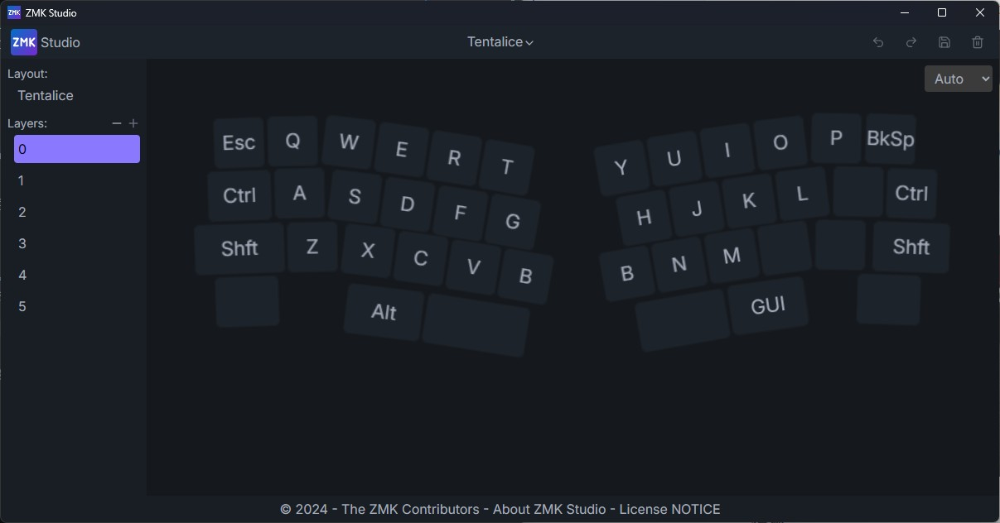

#### 3-2-2. Keymap Editor
**ZMK Keymap Editor**は事前に**GitHub**と連携させておくことで、GUIによる変更だけで、**GitHub**の**workflow**で自動的にファームウェアのビルドをしてくれます。手軽にタップダンスやレイヤーインジケータの色を変更することが可能です。

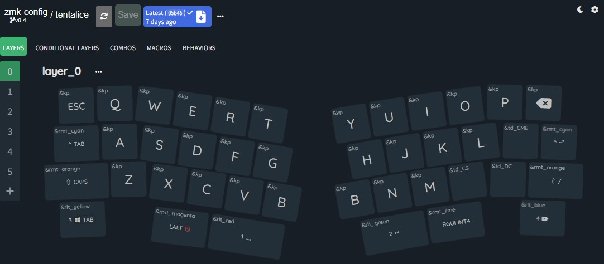

#### 3-2-3. 日本語配列対応
日本で使用するPCのOSの設定は日本語配列キーボードに対応していますが、これはキーボードから送信されるキーコードをOS側で日本語配列のコードと理解し対応する文字に変換しているため[^8]です。例えば、日本語配列の**"（ダブルコーテーション）**は**0x1F**ですが、英語配列の**0x1F**は**@（アットマーク）**です。
上記のキーマップ変更ツールは英語配列を前提に作成されていますので、ダブルコーテーションを入力したい場合、アットマークを設定する必要があります。
そこで**Tentlaice**では、英語配列のコードを日本語配列としてマクロ化しました。

```dts tentalice.keymap
        jp_dquote: jp_dquote {
            compatible = "zmk,behavior-macro";
            #binding-cells = <0>;
            label = "JP_DQUOTE";
            bindings = <&kp AT>;
        };
```

これにより、キーマップ変更ツールのBehaviorから日本語のコードとして選択可能にしています。
~ |             |             |
~ | :---:       | :---:       |
~ | [~g3]       | [~g4]       |
:::warp g3
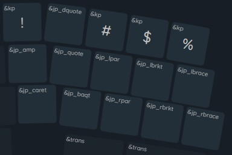

ZMK keymap editor
:::

:::warp g4
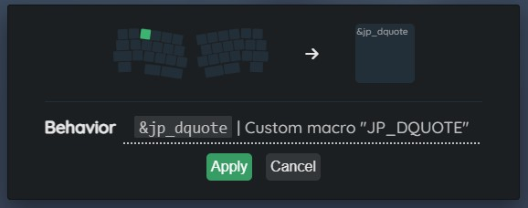

ZMK keymap editor
:::

[^8]:**日本語配列**などは、 [キー配列について（株式会社アーキサイト）](https://archisite.co.jp/pick-up/key-layout/) がイラスト付きで解説してありわかりやすいです。
[^9]:**日本語配列の一覧**作成は、 [【ZMK】OS設定を日本語キーボードのまま使う](https://note.com/kloir_z/n/n314e739f03a1) を参考にさせていただきました。


### 3-3. タップダンス
タップダンスは、一定時間内のタップ（キー押下）数により出力するキーコードを変える機能です。物理的な1つのキーに対し複数のキーを割り当てることができます。
**Tentalice**では以下のタップダンスを登録しています。

| Behavior    | tap         | hold        | tap,tap     | tap,hold    |
| :---:       | :---:       | :---:       | :---:       | :---:       |
| td_CS       | `,` 　　　　 | `,`         | `;`         | `;`         |
| td_DC       | `.`         | `.`         | `:`         | `:`         |
| td_CME      | `-`         | `LCTRL`     | `=`         | `LCTRL`     |

### 3-4. トラックボール
**ドライバー**
ZMK firmwareのv0.4(現時点で最新)で対応したPMW3610ドライバーを使用し、v0.3の外部モジュールドライバよりもスムースにボールを操作できます。

#### 3-4-1. 操作角度
トラックボール操作は右手の親指を想定しており、ZMK Feature Sensor Rotation で45度の回転をつけています。

#### 3-4-2. クリック操作
クリック操作は以下の表の通りです。
| キー | マウス操作 |
| :---: | :---: |
| `右B` | 左クリック |
| `N` | 右クリック |
| `M` | スクロールレイヤー |
| `,` | マウスジェスチャー |

#### 3-4-3. スクロールレイヤー
スクロールレイヤー（leyer1）では、トラックボールの操作がスクロール操作に切り替わります。
**Tentalice**では両手操作用に左手親指で スペース を押下時、片手操作用に M 押下時にleyer1になるよう設定されています。

#### 3-4-4. スクロールスナップ
スクロール操作では上下・左右に方向を固定したほうが使い勝手が良いです。Tentaliceでは最も近い X/Y 軸方向に自動でスナップするスクロールスナップを搭載しています。

#### 3-4-5. マウスジェスチャー
マウスジェスチャーボタンを押下しながら4方向にカーソル移動し、マウスジェスチャーボタンを離すとマウスジェスチャーが発動します。
| ジェスチャー操作 | キー | 動作 
| :---: | :---: | :---: |
| `←` | `LA(LEFT)` | 戻る
| `→` | `LA(RIGHT)` | 進む
| `↑` | `LC(W)` | 新しいタブ
| `↓` | `LC(T)` | タブを閉じる

#### 3-4-6. オートマウスレイヤー
トラックボールを操作すると自動的にオートマウスレイヤー（layer4）がオンになり、マウスクリックが可能です。
**Tentalice**ではトラックボールでマウス操作を完全に代替することを目指しており、クリック操作にストレスが生じないようクリック操作ではオートマウスレイヤーの解除はしないよう時間を長めに設定しています。

以下のキー以外をクリックするとマウスレイヤーを解除します。
```
    excluded-positions = <
        12 /* left Ctrl */
        24 /* left Shift */
        30 /* right B */
        31 /* N */
        32 /* M */
        33 /* , */
        37 /* left Alt */
    >;
```

また、キーの打鍵でオートマウスレイヤーが誤作動しないようにキー入力から一定時間はAMLを発動しないよう設定しています。

#### 3-4-7. ポインタ加速
ポインタ操作に加速度を付けることにより、低速時にはカーソルの細かい操作がより正確になり、高速時にはカーソルの移動速度をが向上します。
**Tentalice**では以下のポインタ加速設定を行っています。
```
    min-factor = <800>;           // 非常に遅い速度で 0.8倍
    max-factor = <3000>;          // 高速時に 3.0倍
    speed-threshold = <1200>;     // 1x（等倍）となる速度の閾値：毎秒 1200 カウント
    speed-max = <6000>;           // 最大加速が適用される速度：毎秒 6000 カウント
    acceleration-exponent = <2>;  // 二次（2乗）による加速曲線
```

### 3-5. LEDレイヤーインジケータ
ZMKのマクロ機能を使用し、レイヤーやモッド（ShiftやCtrlなど）キーを押下している間LEDを点灯させる機能です。親指の4つのキーが点灯します。


点灯色ごとにマクロを割り当て、keymapにマクロをアサインし、引数でレイヤーやモディファイアを渡す形です。
このためKeymap Editorからお好みの色に変えたりできます。

| macro       | Color | Layer/Mod |
| :---:       | :---: | :---:     |
| rlt_red     |      | `Layer1`  |
| rlt_blue    |     | `Layer4`  |
| rlt_green   |    | `Layer2`  |
| rlt_yellow  |   | `Layer3`  |
| rlt_violet  |   | `Layer5`  |
| rmt_orange  |   | `Shift`   |
| rmt_cyan    |     | `Ctrl`    |
| rmt_magenta |  | `Alt`     |
| rmt_lime    |     | `Gui`     |

ちなみに`rlt`は`rgb_layer_tap`、`rmt`は`rgb_mod_tap`という造語の略です。
マクロの作り方解説を [ZMKマクロで作るレイヤーインジケータ](https://note.com/cerbekoskeyboard/n/na5f7abac26e5) に書いてたりします。

## 4.参考文献
本キーボードの制作にあたり、数多くの自作キーボードに関する記事・ドキュメント・ビルドガイドを参考にさせていただきました。先人の知見と情熱に深く感謝いたします。
- [ZMK firmware](https://zmk.dev/)
- [ZMK Studio](https://zmk.studio/)
- [ZMK Keymap Editor](https://nickcoutsos.github.io/keymap-editor/)
- [zmk-mouse-gesture](https://github.com/kot149/zmk-mouse-gesture)
- [zmk-feature-sensor_rotation](https://github.com/hsgw/zmk-feature-sensor_rotation)
- [zmk-pointing-acceleration](https://github.com/oleksandrmaslov/zmk-pointing-acceleration)
- [ZMK + XIAO-nRF52840 を限界まで使った一体型キーボードを作るときのあれこれ](https://qiita.com/BParound30/items/e5d6a0797ef892684880)
- [ZMKのオートマウスレイヤーを極める](https://zenn.dev/kot149/articles/zmk-auto-mouse-layer)
- [ZMK Input Processorチートシート](https://zenn.dev/kot149/articles/zmk-input-processor-cheat-sheet)
- [【ZMK】OS設定を日本語キーボードのまま使う](https://note.com/kloir_z/n/n314e739f03a1)