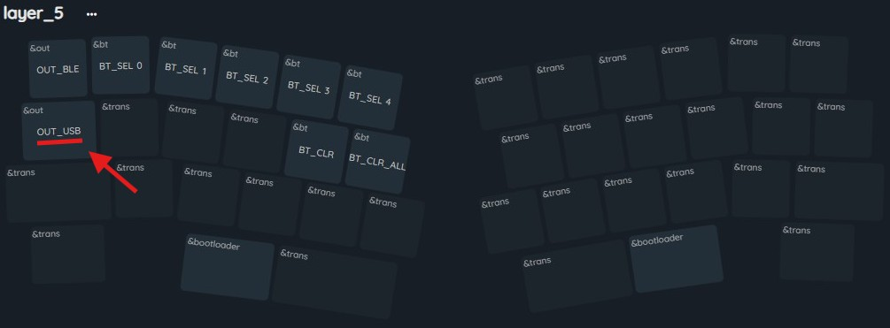

# ZMK Studio
## 1.概要
**ZMK Studio**は、ZMK搭載デバイス向けにランタイムアップデート機能を提供し、キーボードに新しいファームウェアを書き込むことなくキーマップレイヤーを変更できるようにします。


```
⚠️通常、ZMK Studio がキーボードへ変更を加えるためには &studio_unlock を動作させロックを解除する
  必要がありますが、Tentalice では事前に定義済みのため自動的に解除されます。
```

## 2.Webアプリの接続方法
```
⚠️WebアプリはUSB接続時のみ対応しています。
```
1. `Tentalice`を`PC`とUSB接続する
2. `&out OUT_USB` を押す（デフォルトキーマップではLayer5にあります）
    
3. [ZMK Studio](https://zmk.studio/) へアクセスする
4. `USB接続`をクリックし、USBデバイスを選択する
    
## 3.ネイティブアプリの接続方法
```
ℹ️ネイティブアプリはBluetooth接続とUSB接続の両方に対応しています。
ℹ️USB接続の場合、Webアプリの接続と同様に &out OUT_USB を動作させる必要があります。
```
1. [ZNK Studio ダウンロードページ](https://zmk.studio/download)へアクセスする
2. セットアップアプリケーションを起動しインストールする
3. インストールした`ZMK Studio`を起動する
4. `Select A Device`で、bluetoothアイコンが付いている`Tentalice`またはUSBデバイスをクリックする


## 4.キーマップの変更方法
```
ℹ️ZMK Studioでは、同時に複数のキーを変更できます
```
1. 変更したいキーを選択し、`Behavior`[^1]を選択する。
2. `Mod/Layer`や`Key`を選択する
    - 選択する`Behavior`により選択肢が変化します。例えば、`Behavior`に`&kp`を選択した場合、`Keycode`や同時押しする`Modifier`を選択できます
    - 日本語配列対応のキー[^2]を指定したい場合は、`Behavior`に、`JP_`から始まるマクロを指定します
    - レイヤーインジケータの色を変更する場合、`Behavior`に、`rlt_`や`rmt`から始まるマクロを指定します
2. 右上の保存ボタン`💾`を押下する

[^1]:詳細は、[公式ドキュメント](https://zmk.dev/docs/keymaps/behaviors)を参照してください
[^2]:詳細は、[日本語配列対応について](?page=manual2)を参照してください