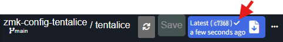
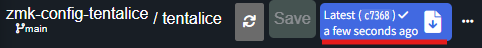
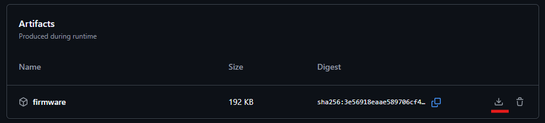
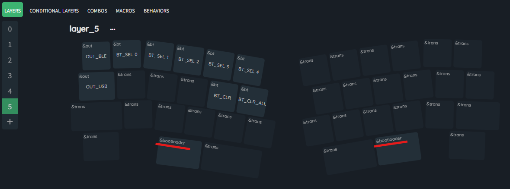

# ZMK Keymap Editor
## 1.概要
**ZMK Keymap Editor** は事前に **GitHub** と連携させておくことで、GUI による変更だけで、**GitHub** の **workflow** で自動的にファームウェアのビルドをしてくれます。手軽にタップダンスやレイヤーインジケータの色を変更することが可能です。


## 2.GitHub 連携方法
```
⚠️GitHub のアカウントが必要です。アカウント登録手順は本書の対象外です
```
`ZMK keymap Editor` を使用するために、`Tentalice`用のリポジトリをフォークし、アプリケーションを連携します。

### 2-1. リポジトリをフォークする
1. [zmk-config-tentalice](https://github.com/Cerbekos/zmk-config-tentalice) へアクセス
2. 右上にある`Fork`をクリック
3. Create a new fork画面で`Create fork`をクリック
4. **Actionsタブ**をクリックし、`I understand my workflows, go ahead and enable them`をクリック
### 2-2. ZMK Keymap Editor にアクセスして GitHub 連携する
1. [ZMK Keymap Editor](https://nickcoutsos.github.io/keymap-editor)へアクセス
2. 初回アクセスであればWelcome画面から**GitHub**を選択
3. **Authenticate with GitHub**の**Login with GitHub**をクリック
4. 自身のGitHub アカウントでサインイン
5. **Authorize**ボタンをクリック
6. Welcome画面で**Add Repository**をクリック
7. Install Keymap Editor画面でアプリケーションをインストールするリポジトリを選択
8. **Only select repositories**を選択
    - `zmk-config-tentalice`をリポジトリを選択
    - **Install** ボタンをクリック
9. キーマップが表示されれば成功

## 3.キーマップ変更方法
```
ℹ️ZMK Keymap Editorでは、同時に複数のキーを変更できます
```

### 3-1.ZMK Keymap Editor(Webアプリ)で、キーマップを変更する
1. 変更したいキーを選択し、`Behavior`[^1]をクリック
2. 右に表示されるリストから`Behavior`を選択
3. 選択した`Behavior`に応じた`Parameters`を選択
    - 例えば、`Behavior`に`&kp`を選択した場合、`Parameters`で押下する`Keycode`と同時押しする`Modifier`を選択できます
    - 日本語配列対応のキー[^2]を指定したい場合は、`Behavior`に、`JP_`から始まるマクロを指定します
    - レイヤーインジケータの色[^3]を変更する場合、`Behavior`に、`rlt_`や`rmt`から始まるマクロを指定します

### 3-2.ZMK Keymap Editor(Webアプリ)で、キーマップを保存する
1. 上部にある`Save`ボタンをクリック
2. Commit keymap changes画面で`Commit`ボタンをクリック
3. フォークしたリポジトリの **GitHub Actions** が実行されるため、ファームウェアが生成されるまで数分待つ
4. 生成が完了したこと（✓がついたこと）を確認する
    

### 3-3.リポジトリからファームウェアをダウンロードする
1. ファームウェアのダウンロードリンクをクリック
    
2. **GitHub Actions** の下部にあるダウンロードボタンをクリック
    
3. `firmware.zip`をPCへダウンロードし保存する
4. `firmware.zip`を解凍する
    - `tentalice-xiao_ble__zmk-zmk.uf2`が含まれています

### 3-4.ファームウェアをTentaliceへ反映する
```
ℹ️&bootloaderを使用してリセットできます（XIAO BLEのリセットボタンを2度押ししなくてよい）
```
1. `Tentalice`を`PC`とUSB接続する
2. `Tentalice`で`&bootloader`キーコードを押下する(デフォルトキーマップではLayer5にあります)
    
3. ダウンロードした`tentalice-xiao_ble__zmk-zmk.uf2`を`XIAO BLE`のフォルダへコピーする
4. 自動的に`Tentalice`が再起動され、変更が反映される

[^1]:詳細は、[公式ドキュメント](https://zmk.dev/docs/keymaps/behaviors)を参照してください
[^2]:詳細は、[日本語配列対応について](?page=manual2)を参照してください
[^3]:詳細は、[概要ページ>3-5.LEDインジケータ](?page=intro)を参照してください
