# パーツリスト

## 1.付属品
以下は、キーボードキットに付属している部品です。
キットはこちらから - [BOOTH - Tentalice by Cerbekos-keyboard](https://cerbekoskeyboard.booth.pm/)

| No | 部品名 | 数量 | 画像 | 備考 |
|:--------:|:--------:|:------:|:------:|:------:|
| 1 | メイン基板 | 1 | 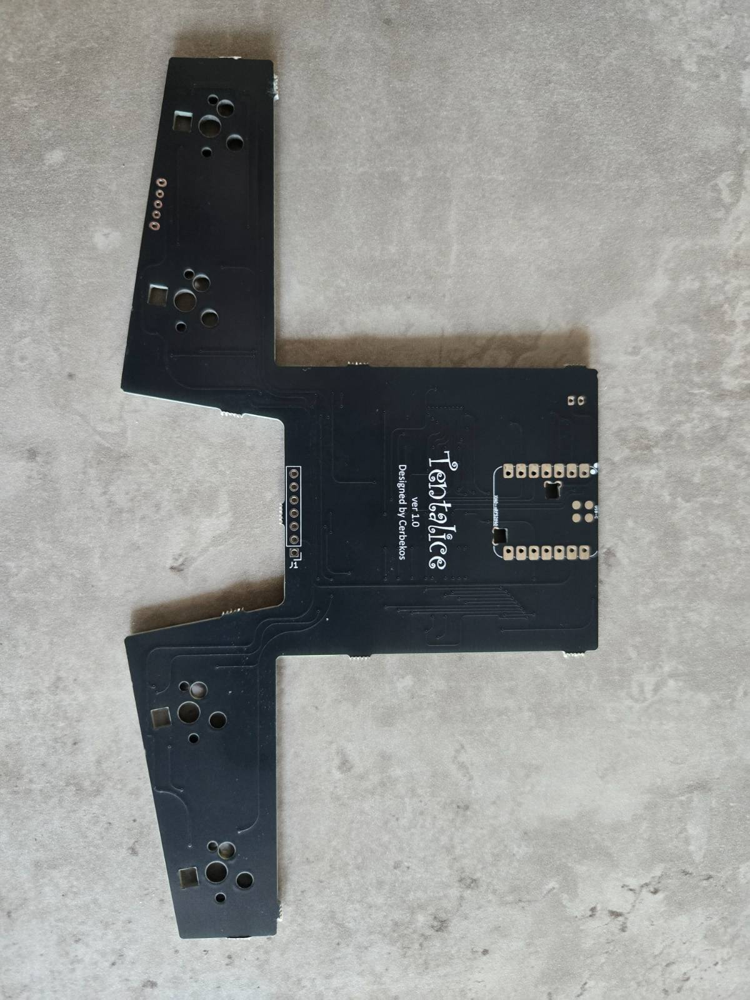 | 一部部品実装済み（PCBA） |
| 2 | 左部基板 | 1 | 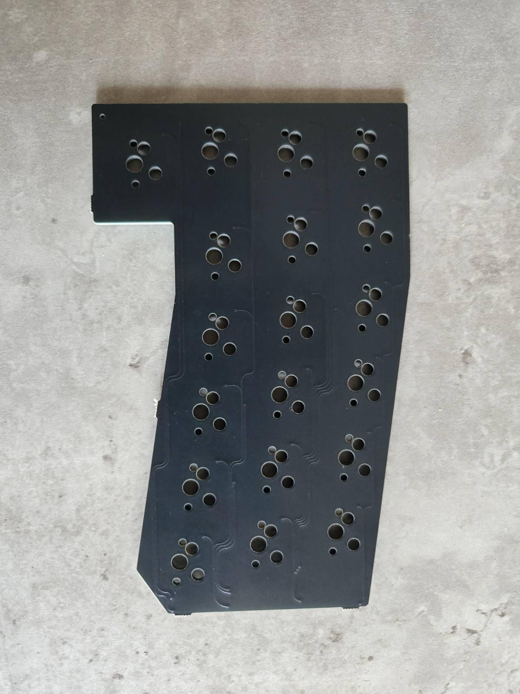 | 一部部品実装済み（PCBA） |
| 3 | 右部基板 | 1 | 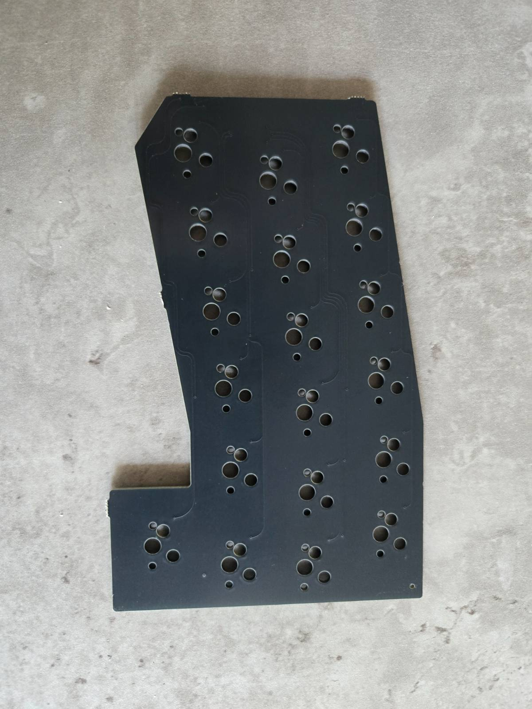 | 一部部品実装済み（PCBA） |
| 4 | PMW3610 ブレークアウトボード | 1 | 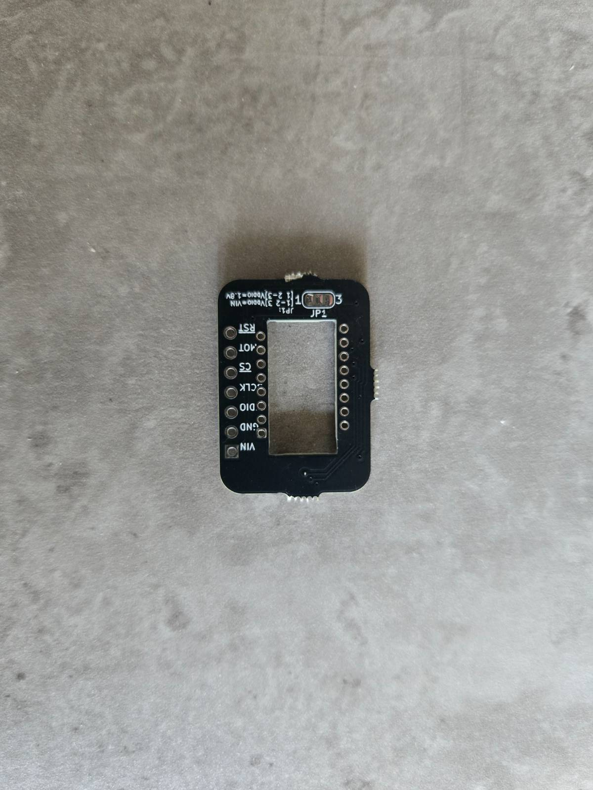 | 部品実装済み（PCBA） |
| 5 | PMW3610 光学マウスセンサー | 1 | 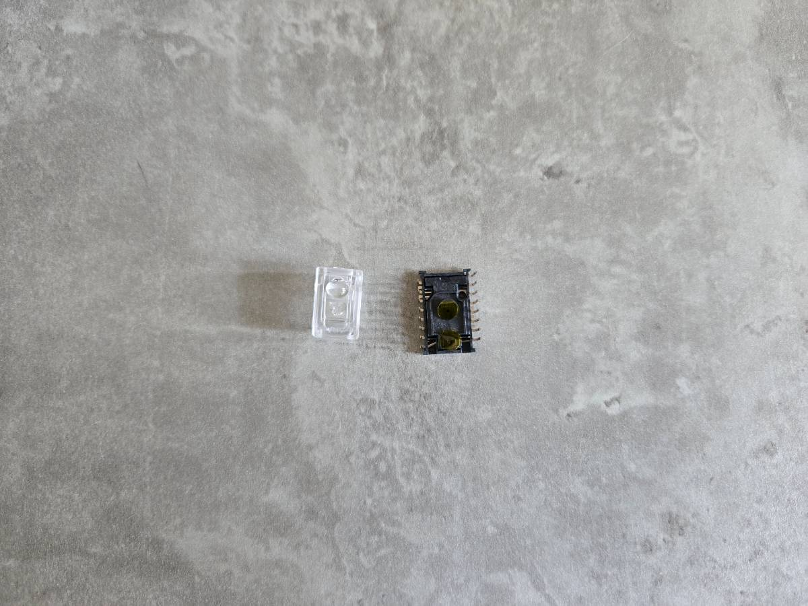 |  |
| 6 | L字コネクタ | 1 | 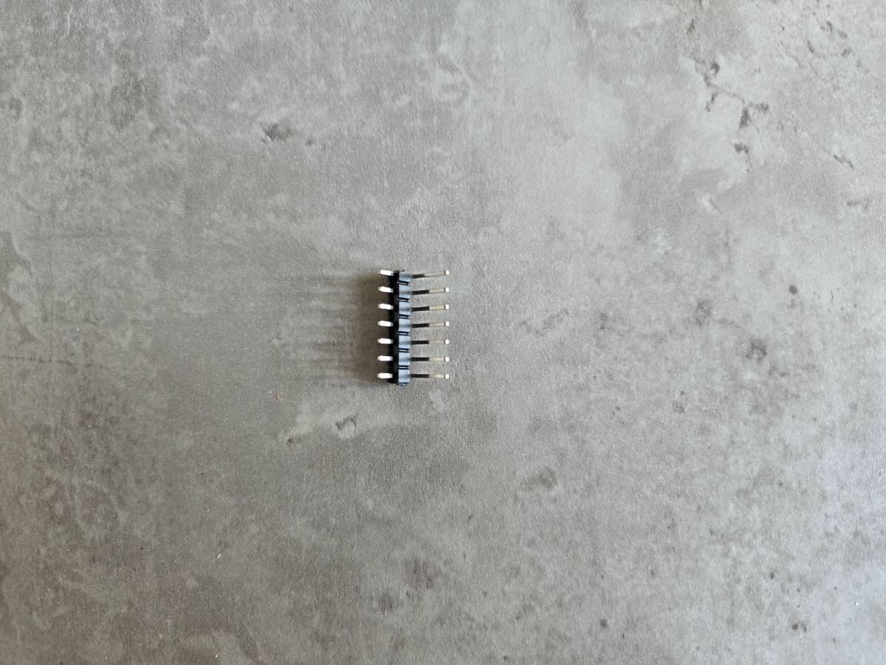 |  |
| 7 | スライドスイッチ SK-12D11VG3 | 1 | 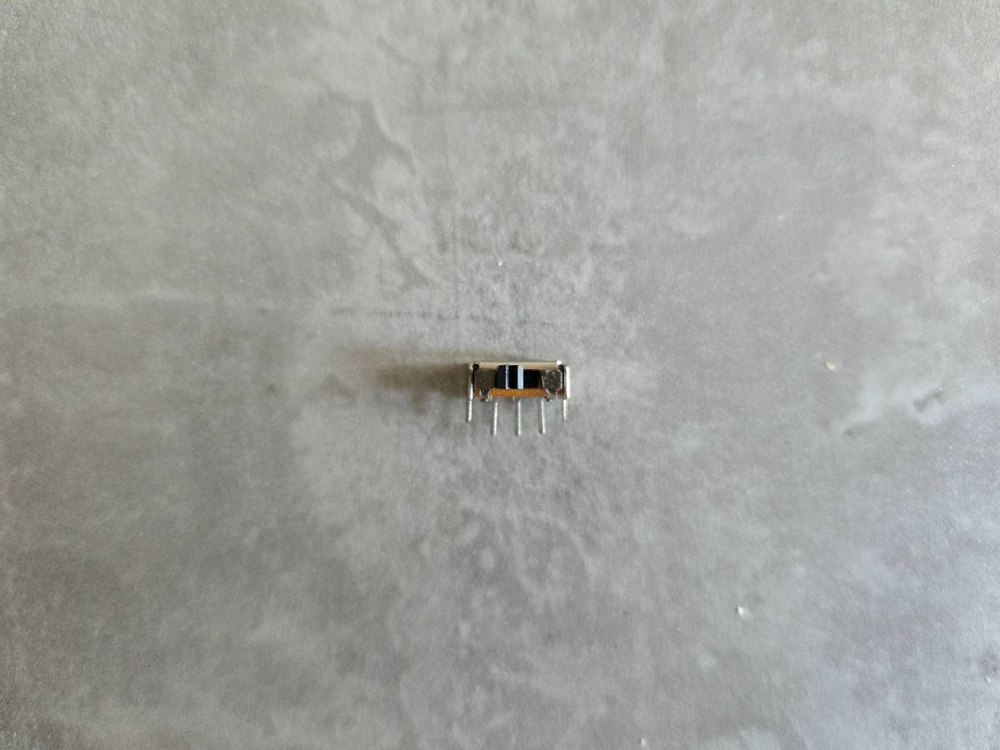 |  |
| 8 | PHコネクターベース サイド型 | 1 | 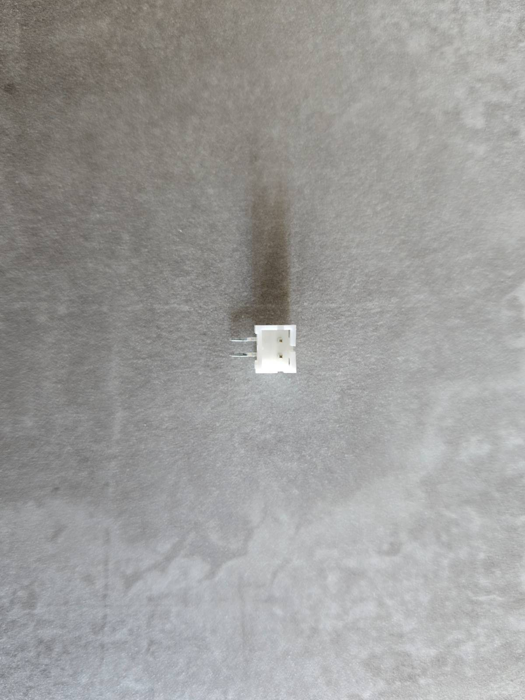 |  |
| 9 | フレキシブルケーブル | 2 | 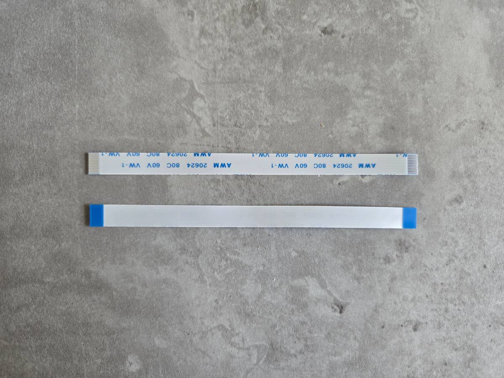 |  |
| 10 | ケース用マグネット（ネオジム磁石） | 8 | 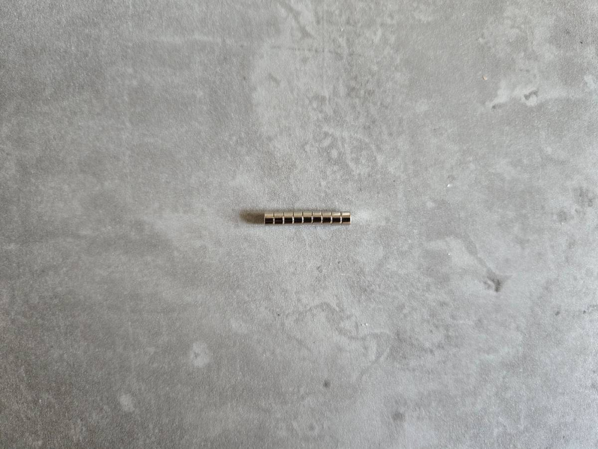 | 3Dプリントケース用 |
| 11 | ケース用支持球 | 3 | 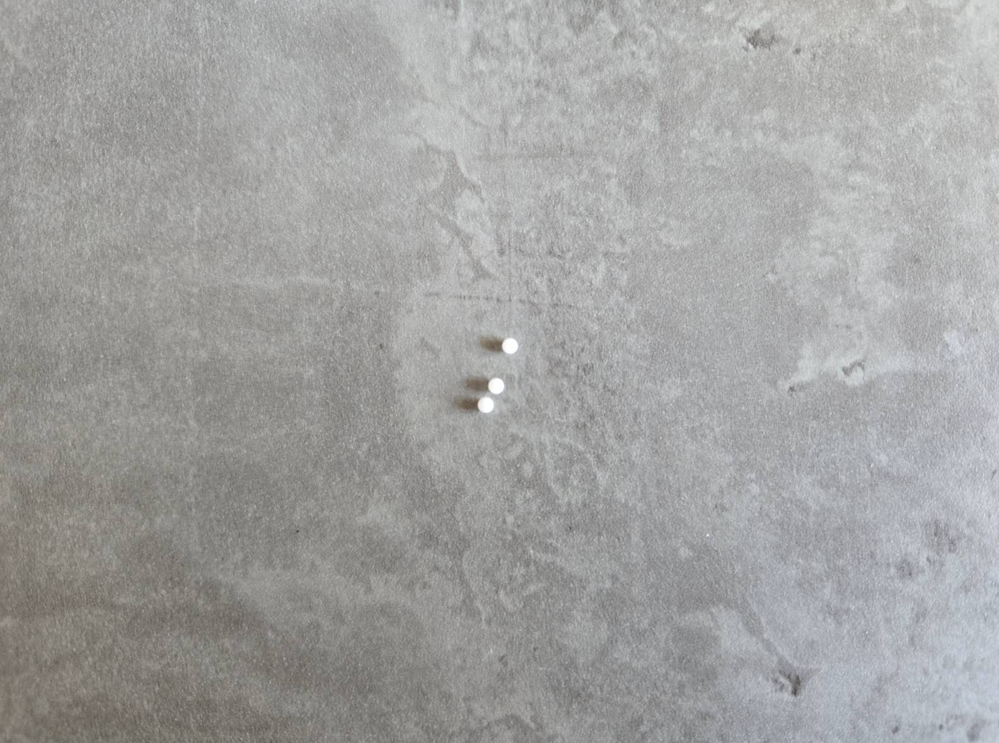 | 3Dプリントケース用 | 

## 2.別途調達が必要な部品
以下は、購入者様にて調達が必要な部品です。

| No | 部品名 | 数量 | 画像 | 備考 |
|:--------:|:--------:|:------:|:------:|:------:|
| 1 | お好みのキースイッチ | 42 |  | Cherry MX互換 |
| 2 | お好みのキーキャップ | 42 |  | 1u×33, 1.25u×3, 1.5u×3, 1.75u×2, 2u×1 |
| 3 | XIAO BLE nRF52840 | 1 | 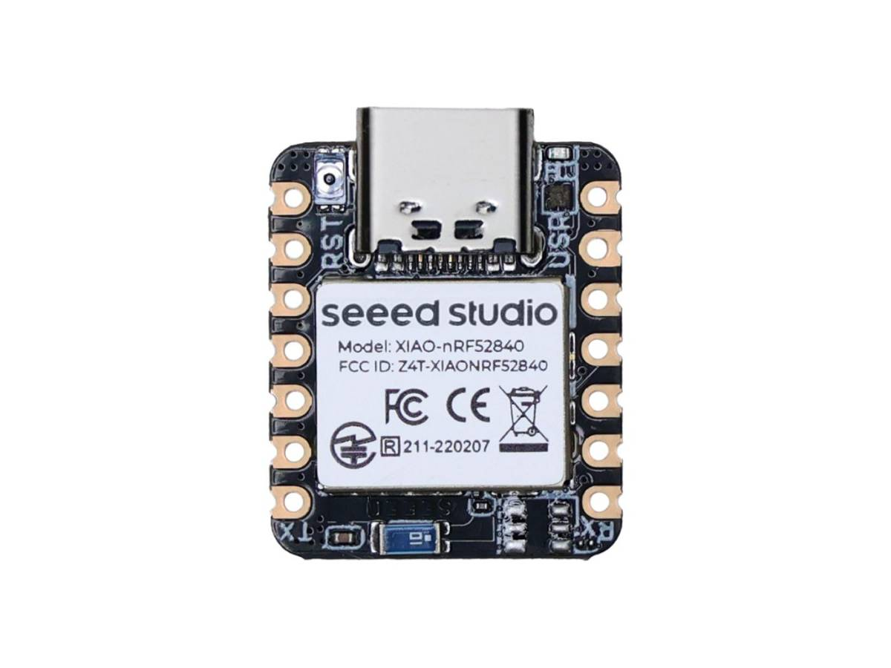 |  |
| 4 | LiPoバッテリー | 1 | 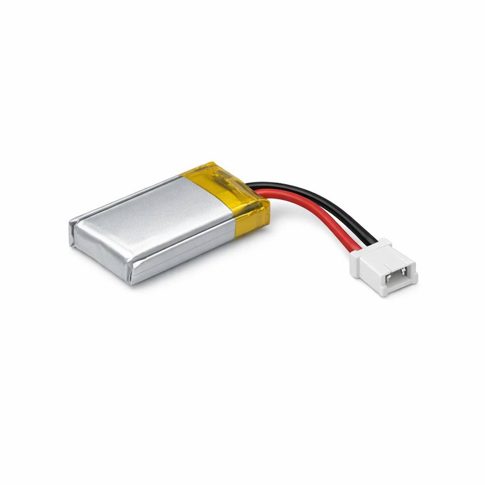 | PHコネクタ互換 |
| 5 | LED SK6812MINI-E | 4 | 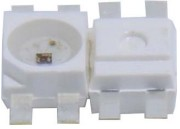 | 取り付けなくてもOK |
| 6 | 3Dプリントケース(トップ) | 1 |  | [Tentalice-3Dプリントケース(BOOTH)](https://cerbekoskeyboard.booth.pm/) |
| 7 | 3Dプリントケース（ボトム） | 1 |  | \--- |
| 8 | 3Dプリントケース（スイッチカバー） | 1 |  | \--- |
| 9 | 34mmボール | 1 |  |  |

## 3.組み立て工具類
組み立てには以下の工具が必要です。
- はんだごて　※温度調節可能なものを推奨
- はんだ　※鉛フリーではないものを推奨
- プリント基板用フラックス
- はんだこて台
- はんだ吸い取り線（失敗したときのため）
- ピンセット
- マスキングテープ

~ |             |             |
~ | :---:       | :---:       |
~ | [はじめに](?page=before)　←　前へ       | 次へ　→　[ビルドガイド](?page=assembly)       |